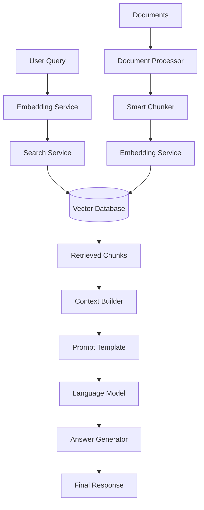

# AI and RAG Services Guide

## Table of Contents
- [RAG Architecture Overview](#rag-architecture-overview)
- [Core RAG Components](#core-rag-components)
- [Document Processing Pipeline](#document-processing-pipeline)
- [Advanced Features](#advanced-features)
- [Configuration and Tuning](#configuration-and-tuning)
- [Performance Optimization](#performance-optimization)
- [Testing and Evaluation](#testing-and-evaluation)

## RAG Architecture Overview

The APEX Afeka ChatBot uses a sophisticated RAG (Retrieval-Augmented Generation) system built with modular components for maximum flexibility and performance.



### Key Components

1. **RAG Orchestrator**: Coordinates all RAG operations
2. **Embedding Service**: Converts text to vector embeddings
3. **Search Service**: Performs semantic search in vector database
4. **Context Builder**: Constructs context from retrieved chunks
5. **Answer Generator**: Generates responses using LLM
6. **Document Processor**: Handles document ingestion and processing
7. **Smart Chunker**: Intelligently splits documents into chunks

## Core RAG Components

### RAG Orchestrator

**Location:** `src/ai/services/rag/rag_orchestrator.py`

Main coordination class that orchestrates the entire RAG pipeline.

```python
from src.ai.services import RAGOrchestrator

class RAGOrchestrator:
    def __init__(self, config: RAGConfig = None):
        """
        Initialize RAG system with configuration.
        
        Args:
            config: RAG configuration object
        """
        self.embedding_service = EmbeddingService(config.embedding)
        self.search_service = SearchService(config.search)
        self.context_builder = ContextBuilder(config.context)
        self.answer_generator = AnswerGenerator(config.generation)
        self.analytics = SearchAnalytics()
        
    async def process_query(
        self, 
        query: str, 
        user_id: str,
        max_results: int = 5,
        threshold: float = 0.7,
        filters: Dict = None
    ) -> RAGResult:
        """
        Process a query through the complete RAG pipeline.
        
        Args:
            query: User's question
            user_id: Unique user identifier
            max_results: Maximum number of chunks to retrieve
            threshold: Minimum similarity threshold
            filters: Optional filters for search
            
        Returns:
            RAGResult containing response and metadata
        """
```

**Usage Example:**
```python
# Initialize RAG service
rag_config = RAGConfig(
    embedding_model="text-embedding-3-small",
    search_threshold=0.7,
    max_context_length=4000
)
rag_service = RAGOrchestrator(rag_config)

# Process query
result = await rag_service.process_query(
    query="מה הם דרישות הסיום ללימודי מדעי המחשב?",
    user_id="user_123",
    max_results=5,
    filters={"category": ["academic", "regulations"]}
)

# Access results
print(f"Response: {result.response}")
print(f"Sources: {len(result.sources)} chunks found")
print(f"Confidence: {result.confidence_score}")
```

### Embedding Service

**Location:** `src/ai/services/rag/embedding_service.py`

Handles text-to-vector conversions with multiple embedding model support.

```python
class EmbeddingService:
    def __init__(self, config: EmbeddingConfig):
        """
        Initialize embedding service.
        
        Supported models:
        - OpenAI: text-embedding-3-small, text-embedding-3-large
        - Google: textembedding-gecko@003
        - Local: sentence-transformers models
        """
        
    async def embed_text(self, text: str) -> List[float]:
        """Convert text to embedding vector"""
        
    async def embed_batch(self, texts: List[str]) -> List[List[float]]:
        """Convert multiple texts to embeddings (batch processing)"""
        
    def get_embedding_dimension(self) -> int:
        """Get the dimension of embeddings produced by this service"""
```

**Configuration:**
```python
embedding_config = EmbeddingConfig(
    model_name="text-embedding-3-small",
    dimension=1536,
    batch_size=100,
    api_key="your_api_key",
    cache_embeddings=True,
    cache_ttl=3600  # 1 hour
)
```

### Search Service

**Location:** `src/ai/services/rag/search_services.py`

Performs semantic search with advanced filtering and ranking.

```python
class SearchService:
    def __init__(self, config: SearchConfig):
        """Initialize search service with vector database connection"""
        
    async def search_similar(
        self, 
        query_embedding: List[float],
        limit: int = 10,
        threshold: float = 0.7,
        filters: Dict = None,
        rerank: bool = True
    ) -> List[SearchResult]:
        """
        Search for similar chunks in vector database.
        
        Args:
            query_embedding: Vector representation of query
            limit: Maximum results to return
            threshold: Minimum similarity score
            filters: Metadata filters (category, language, etc.)
            rerank: Apply re-ranking algorithm
            
        Returns:
            List of SearchResult objects sorted by relevance
        """
        
    async def hybrid_search(
        self,
        query: str,
        query_embedding: List[float],
        limit: int = 10,
        alpha: float = 0.7  # Weight for semantic vs keyword search
    ) -> List[SearchResult]:
        """Combine semantic and keyword search for better results"""
```

**Search Result Model:**
```python
class SearchResult:
    chunk_id: str
    content: str
    score: float
    metadata: Dict
    document_info: DocumentInfo
    
class DocumentInfo:
    document_id: str
    title: str
    category: str
    language: str
    page: Optional[int]
    section: Optional[str]
```

### Context Builder

**Location:** `src/ai/services/rag/context_builder.py`

Constructs optimized context from retrieved chunks.

```python
class ContextBuilder:
    def __init__(self, config: ContextConfig):
        """
        Initialize context builder.
        
        Features:
        - Token counting and management
        - Chunk deduplication
        - Content prioritization
        - Source tracking
        """
        
    def build_context(
        self, 
        search_results: List[SearchResult],
        max_tokens: int = 4000,
        include_metadata: bool = True
    ) -> ContextResult:
        """
        Build optimized context from search results.
        
        Args:
            search_results: Results from vector search
            max_tokens: Maximum tokens for context
            include_metadata: Include source information
            
        Returns:
            ContextResult with formatted context and metadata
        """
        
    def deduplicate_chunks(
        self, 
        chunks: List[SearchResult],
        similarity_threshold: float = 0.9
    ) -> List[SearchResult]:
        """Remove duplicate or very similar chunks"""
        
    def prioritize_chunks(
        self, 
        chunks: List[SearchResult],
        query: str
    ) -> List[SearchResult]:
        """Reorder chunks based on relevance and quality"""
```

### Answer Generator

**Location:** `src/ai/services/rag/answer_generator.py`

Generates responses using LLM with retrieved context.

```python
class AnswerGenerator:
    def __init__(self, config: GenerationConfig):
        """
        Initialize answer generator.
        
        Supported models:
        - Google Gemini (gemini-1.5-flash, gemini-1.5-pro)
        - OpenAI GPT (gpt-4o, gpt-4o-mini)
        - Claude (claude-3-sonnet, claude-3-haiku)
        """
        
    async def generate_answer(
        self,
        query: str,
        context: str,
        conversation_history: List[Dict] = None,
        language: str = "he"
    ) -> GenerationResult:
        """
        Generate answer using LLM with provided context.
        
        Args:
            query: User's question
            context: Retrieved and formatted context
            conversation_history: Previous messages
            language: Response language (he/en)
            
        Returns:
            GenerationResult with answer and metadata
        """
        
    async def generate_streaming_answer(
        self,
        query: str,
        context: str,
        conversation_history: List[Dict] = None
    ) -> AsyncGenerator[str, None]:
        """Generate streaming response for real-time display"""
```

**Generation Configuration:**
```python
generation_config = GenerationConfig(
    model_name="gemini-1.5-flash",
    temperature=0.3,
    max_tokens=1000,
    top_p=0.9,
    stream=True,
    system_prompt_template="academic_assistant_he"
)
```

## Document Processing Pipeline

### Document Processor

**Location:** `src/ai/services/document_processor.py`

Comprehensive document processing with multiple format support.

```python
class DocumentProcessor:
    def __init__(self, config: ProcessingConfig):
        """
        Initialize document processor.
        
        Supported formats:
        - PDF (with OCR support)
        - DOCX/DOC
        - TXT
        - HTML
        - Markdown
        """
        
    async def process_document(
        self,
        file_path: str,
        document_type: str,
        metadata: Dict = None
    ) -> ProcessingResult:
        """
        Process document through complete pipeline.
        
        Pipeline steps:
        1. Text extraction
        2. Language detection
        3. Content cleaning
        4. Smart chunking
        5. Embedding generation
        6. Vector storage
        
        Args:
            file_path: Path to document file
            document_type: File type (pdf, docx, txt, etc.)
            metadata: Additional document metadata
            
        Returns:
            ProcessingResult with processing statistics
        """
        
    async def extract_text(
        self, 
        file_path: str, 
        document_type: str
    ) -> ExtractionResult:
        """Extract text from various document formats"""
        
    def detect_language(self, text: str) -> LanguageResult:
        """Detect document language with confidence score"""
        
    def clean_content(self, text: str) -> str:
        """Clean and normalize extracted text"""
```

**Processing Result:**
```python
class ProcessingResult:
    document_id: str
    filename: str
    total_chunks: int
    total_tokens: int
    language: str
    processing_time_seconds: float
    status: ProcessingStatus
    error_message: Optional[str]
    metadata: Dict
```

### Smart Chunker

**Location:** `src/ai/services/smart_chunker.py`

Advanced chunking with semantic awareness and content structure preservation.

```python
class SmartChunker:
    def __init__(self, config: ChunkingConfig):
        """
        Initialize smart chunker.
        
        Features:
        - Semantic chunking
        - Structure preservation
        - Overlap management
        - Size optimization
        """
        
    def create_semantic_chunks(
        self,
        text: str,
        max_chunk_size: int = 1000,
        overlap_size: int = 200,
        preserve_structure: bool = True
    ) -> List[ChunkResult]:
        """
        Create semantically coherent chunks.
        
        Args:
            text: Input text to chunk
            max_chunk_size: Maximum tokens per chunk
            overlap_size: Overlap between adjacent chunks
            preserve_structure: Maintain document structure
            
        Returns:
            List of ChunkResult objects
        """
        
    def detect_sections(self, text: str) -> List[Section]:
        """Detect document sections and hierarchy"""
        
    def optimize_chunk_boundaries(
        self, 
        chunks: List[str]
    ) -> List[str]:
        """Optimize chunk boundaries for better coherence"""
```

**Chunking Strategies:**
```python
class ChunkingStrategy(Enum):
    FIXED_SIZE = "fixed_size"
    SEMANTIC = "semantic"
    SENTENCE_BOUNDARY = "sentence_boundary"
    PARAGRAPH_BOUNDARY = "paragraph_boundary"
    SECTION_BOUNDARY = "section_boundary"
```

## Advanced Features

### Multi-Modal RAG

Support for processing images and tables within documents.

```python
class MultiModalProcessor:
    async def process_images(
        self, 
        document: Document
    ) -> List[ImageDescription]:
        """Extract and describe images using vision models"""
        
    async def process_tables(
        self, 
        document: Document
    ) -> List[TableStructure]:
        """Extract and structure table data"""
```

### Query Enhancement

Improve user queries before processing.

```python
class QueryEnhancer:
    async def enhance_query(
        self, 
        query: str,
        conversation_history: List[Dict] = None
    ) -> EnhancedQuery:
        """
        Enhance user query with:
        - Spell correction
        - Query expansion
        - Context completion
        - Intent classification
        """
        
    def correct_spelling(self, query: str) -> str:
        """Correct spelling errors in Hebrew and English"""
        
    def expand_query(self, query: str) -> List[str]:
        """Generate query variations for better retrieval"""
```

### Re-ranking System

Improve search results with advanced re-ranking.

```python
class ReRanker:
    def __init__(self, model_name: str = "cross-encoder"):
        """Initialize re-ranking model"""
        
    async def rerank_results(
        self,
        query: str,
        results: List[SearchResult],
        top_k: int = 10
    ) -> List[SearchResult]:
        """Re-rank search results using cross-encoder model"""
```

### Conversation Memory

Maintain conversation context across multiple exchanges.

```python
class ConversationMemory:
    def __init__(self, window_size: int = 10):
        """Initialize conversation memory with sliding window"""
        
    def add_exchange(
        self, 
        user_message: str, 
        bot_response: str,
        metadata: Dict = None
    ):
        """Add new conversation exchange"""
        
    def get_relevant_history(
        self, 
        current_query: str,
        max_exchanges: int = 5
    ) -> List[Dict]:
        """Get relevant conversation history for current query"""
```

## Configuration and Tuning

### RAG Configuration

```python
from dataclasses import dataclass

@dataclass
class RAGConfig:
    # Embedding settings
    embedding_model: str = "text-embedding-3-small"
    embedding_dimension: int = 1536
    
    # Search settings
    search_threshold: float = 0.7
    max_search_results: int = 10
    hybrid_search_alpha: float = 0.7
    
    # Context settings
    max_context_tokens: int = 4000
    include_source_metadata: bool = True
    deduplicate_threshold: float = 0.9
    
    # Generation settings
    llm_model: str = "gemini-1.5-flash"
    temperature: float = 0.3
    max_response_tokens: int = 1000
    
    # Processing settings
    chunk_size: int = 1000
    chunk_overlap: int = 200
    chunking_strategy: str = "semantic"
    
    # Performance settings
    enable_caching: bool = True
    cache_ttl: int = 3600
    batch_size: int = 100
```

### Environment-Specific Configurations

```python
# Development configuration
dev_config = RAGConfig(
    embedding_model="text-embedding-3-small",
    llm_model="gemini-1.5-flash",
    search_threshold=0.6,  # Lower threshold for development
    enable_caching=False,  # Disable caching for testing
    temperature=0.5        # Higher temperature for varied responses
)

# Production configuration
prod_config = RAGConfig(
    embedding_model="text-embedding-3-large",
    llm_model="gemini-1.5-pro",
    search_threshold=0.7,
    enable_caching=True,
    cache_ttl=7200,        # 2 hours cache
    temperature=0.3        # Lower temperature for consistency
)
```

## Performance Optimization

### Caching Strategies

```python
class RAGCache:
    def __init__(self, redis_url: str = None):
        """Initialize caching system with Redis backend"""
        
    async def cache_embeddings(
        self, 
        text: str, 
        embedding: List[float],
        ttl: int = 3600
    ):
        """Cache text embeddings"""
        
    async def cache_search_results(
        self,
        query_hash: str,
        results: List[SearchResult],
        ttl: int = 1800
    ):
        """Cache search results"""
        
    async def cache_generation_result(
        self,
        context_hash: str,
        response: str,
        ttl: int = 3600
    ):
        """Cache generated responses"""
```

### Batch Processing

```python
class BatchProcessor:
    async def process_documents_batch(
        self, 
        documents: List[str],
        batch_size: int = 10
    ) -> List[ProcessingResult]:
        """Process multiple documents efficiently"""
        
    async def embed_texts_batch(
        self, 
        texts: List[str],
        batch_size: int = 100
    ) -> List[List[float]]:
        """Generate embeddings in batches"""
```

### Resource Management

```python
class ResourceManager:
    def __init__(self, max_concurrent: int = 10):
        """Manage concurrent operations and resource usage"""
        
    async def limit_concurrent_operations(self, operation):
        """Limit number of concurrent expensive operations"""
        
    def monitor_memory_usage(self) -> MemoryStats:
        """Monitor and report memory usage"""
        
    def optimize_vector_storage(self):
        """Optimize vector database for better performance"""
```

## Testing and Evaluation

### RAG Test Pro System

**Location:** `RAG_Test_Pro/`

Comprehensive testing and evaluation framework.

```python
class RAGEvaluator:
    def __init__(self, test_config: TestConfig):
        """Initialize RAG evaluation system"""
        
    async def evaluate_retrieval(
        self, 
        test_queries: List[TestQuery]
    ) -> RetrievalMetrics:
        """
        Evaluate retrieval performance:
        - Precision@K
        - Recall@K
        - MRR (Mean Reciprocal Rank)
        - NDCG (Normalized Discounted Cumulative Gain)
        """
        
    async def evaluate_generation(
        self,
        test_cases: List[TestCase]
    ) -> GenerationMetrics:
        """
        Evaluate generation quality:
        - BLEU score
        - ROUGE score
        - Semantic similarity
        - Human evaluation scores
        """
        
    async def evaluate_end_to_end(
        self,
        test_scenarios: List[TestScenario]
    ) -> E2EMetrics:
        """Evaluate complete RAG pipeline performance"""
```

### Test Configuration

```python
test_config = TestConfig(
    test_data_path="RAG_Test_Pro/test_questions/",
    ground_truth_path="RAG_Test_Pro/ground_truth/",
    evaluation_metrics=[
        "retrieval_precision_5",
        "retrieval_recall_5", 
        "generation_bleu",
        "generation_rouge_l",
        "end_to_end_accuracy"
    ],
    languages=["he", "en"],
    categories=["academic", "regulations", "general"]
)
```

### Performance Monitoring

```python
class RAGMonitor:
    def track_query_latency(self, query: str, latency_ms: float):
        """Track query processing latency"""
        
    def track_retrieval_quality(
        self, 
        query: str, 
        results: List[SearchResult]
    ):
        """Monitor retrieval result quality"""
        
    def track_user_satisfaction(
        self, 
        query: str, 
        response: str, 
        user_feedback: UserFeedback
    ):
        """Track user satisfaction and feedback"""
        
    def generate_performance_report(
        self, 
        time_period: str = "24h"
    ) -> PerformanceReport:
        """Generate comprehensive performance report"""
```

### A/B Testing Framework

```python
class RAGABTesting:
    def __init__(self, test_variants: List[RAGConfig]):
        """Initialize A/B testing with different RAG configurations"""
        
    async def run_ab_test(
        self,
        test_queries: List[str],
        user_segment: str = "all"
    ) -> ABTestResult:
        """Run A/B test comparing different RAG configurations"""
        
    def analyze_test_results(
        self, 
        results: ABTestResult
    ) -> TestAnalysis:
        """Analyze A/B test results with statistical significance"""
```

This comprehensive guide covers all aspects of the AI and RAG services in the APEX Afeka ChatBot, providing detailed implementation guidance and best practices for each component.