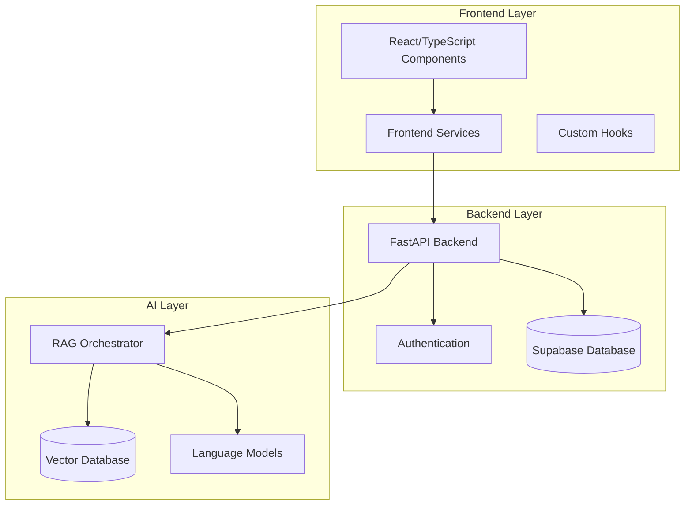

# APEX Afeka ChatBot - Documentation Index

## 📚 Complete Documentation Suite

This is the comprehensive documentation for the APEX Afeka ChatBot - an intelligent AI-powered chatbot designed for Afeka College students to access academic regulations and information.

## 📋 Documentation Files Overview

### 1. [Main API Documentation](./API_DOCUMENTATION.md)
**Primary reference for all APIs, functions, and components**
- Project overview and architecture
- Frontend APIs and services
- Backend APIs and endpoints  
- AI service components
- Usage examples and integration guides
- Development and deployment instructions

### 2. [Frontend Components Guide](./FRONTEND_COMPONENTS_GUIDE.md)
**Detailed frontend development guide**
- React components documentation
- Custom hooks and utilities
- TypeScript interfaces
- Styling and theming
- Testing patterns
- Component usage examples

### 3. [Backend API Guide](./BACKEND_API_GUIDE.md)
**Comprehensive backend API reference**
- REST API endpoints
- Authentication and authorization
- Database models and schemas
- Service layer documentation
- Error handling and testing
- Performance considerations

### 4. [AI and RAG Services Guide](./AI_RAG_SERVICES_GUIDE.md)
**Advanced AI and RAG system documentation**
- RAG architecture and components
- Document processing pipeline
- Advanced features and configuration
- Performance optimization
- Testing and evaluation frameworks

## 🚀 Quick Start Guide

### For Developers New to the Project

1. **Start with** → [Main API Documentation](./API_DOCUMENTATION.md#project-overview)
2. **Frontend Development** → [Frontend Components Guide](./FRONTEND_COMPONENTS_GUIDE.md#core-components)
3. **Backend Development** → [Backend API Guide](./BACKEND_API_GUIDE.md#api-overview)
4. **AI/RAG Work** → [AI and RAG Services Guide](./AI_RAG_SERVICES_GUIDE.md#rag-architecture-overview)

### For Specific Tasks

| Task | Documentation Section |
|------|----------------------|
| **Setting up the project** | [Main API - Development Guide](./API_DOCUMENTATION.md#development-guide) |
| **Creating new components** | [Frontend Components Guide](./FRONTEND_COMPONENTS_GUIDE.md#core-components) |
| **Adding API endpoints** | [Backend API Guide](./BACKEND_API_GUIDE.md#chat-api) |
| **Working with chat functionality** | [Main API - Frontend APIs](./API_DOCUMENTATION.md#frontend-apis) |
| **Document processing** | [AI Services - Document Processing](./AI_RAG_SERVICES_GUIDE.md#document-processing-pipeline) |
| **RAG configuration** | [AI Services - Configuration](./AI_RAG_SERVICES_GUIDE.md#configuration-and-tuning) |
| **Testing the system** | [AI Services - Testing](./AI_RAG_SERVICES_GUIDE.md#testing-and-evaluation) |

## 🏗️ System Architecture



## 🔧 Technology Stack

### Frontend
- **Framework**: React 18 with TypeScript
- **Build Tool**: Vite
- **Styling**: Tailwind CSS
- **State Management**: React Context + Custom Hooks
- **Authentication**: Supabase Auth
- **Internationalization**: React i18n (Hebrew/English)

### Backend
- **Framework**: Python FastAPI
- **Database**: Supabase (PostgreSQL)
- **Authentication**: Supabase JWT
- **API Documentation**: Swagger/OpenAPI
- **Async Processing**: AsyncIO

### AI Services
- **RAG Framework**: Custom modular architecture
- **Language Models**: Google Gemini, OpenAI GPT
- **Embeddings**: OpenAI text-embedding-3
- **Vector Database**: Integrated with Supabase
- **Document Processing**: Multi-format support (PDF, DOCX, TXT)

### Infrastructure
- **Containerization**: Docker + Docker Compose
- **Reverse Proxy**: Nginx
- **Development**: Hot-reload support
- **Testing**: pytest (Backend), Jest (Frontend)

## 📖 Key APIs and Services

### Core Chat API
```typescript
// Send chat message
POST /api/chat
{
  "message": "מה הם דרישות הסיום?",
  "user_id": "user_123",
  "history": [...]
}

// Streaming chat
POST /api/chat/stream
// Returns Server-Sent Events
```

### Document Management
```typescript
// Upload document
POST /api/documents/upload
Content-Type: multipart/form-data

// List documents
GET /api/documents?category=regulations&status=ready
```

### Vector Search
```typescript
// Semantic search
POST /api/vector/search
{
  "query": "graduation requirements",
  "limit": 10,
  "threshold": 0.7
}
```

### Frontend Services
```typescript
// Chat service
import { chatService } from '@/services/chatService';

const result = await chatService.sendChatMessage(
  "שאלה על התקנון",
  userId,
  history
);

// Streaming chat
await chatService.sendStreamingMessage(
  message,
  userId,
  history,
  {
    onChunk: (chunk) => updateUI(chunk),
    onComplete: (response) => setFinalResponse(response)
  }
);
```

### RAG Services
```python
# Initialize RAG
from src.ai.services import RAGOrchestrator

rag_service = RAGOrchestrator()

# Process query
result = await rag_service.process_query(
    query="מה הם דרישות הסיום?",
    user_id="user_123",
    max_results=5
)
```

## 🎯 Common Use Cases

### 1. Adding a New Chat Feature
1. **Frontend**: Create component in `src/frontend/src/components/Chat/`
2. **Backend**: Add endpoint in `src/backend/app/api/routes/`
3. **AI**: Extend RAG service in `src/ai/services/`
4. **Documentation**: Update relevant guides

### 2. Processing New Document Type
1. **AI Service**: Extend `DocumentProcessor` class
2. **Backend**: Add upload endpoint support
3. **Frontend**: Update upload component
4. **Testing**: Add test cases in `RAG_Test_Pro/`

### 3. Implementing New Search Feature
1. **AI Service**: Extend `SearchService` class
2. **Backend**: Add search endpoint
3. **Frontend**: Create search component
4. **Vector DB**: Update schema if needed

## 🔍 Quick Reference

### Environment Variables
```bash
# Frontend (.env)
VITE_BACKEND_URL=http://localhost:8000
VITE_SUPABASE_URL=your_supabase_url
VITE_SUPABASE_ANON_KEY=your_supabase_key

# Backend (.env)
SUPABASE_URL=your_supabase_url
SUPABASE_KEY=your_supabase_key
GEMINI_API_KEY=your_gemini_key

# AI Service (.env)
BACKEND_URL=http://localhost:8000
DEBUG=false
```

### Docker Commands
```bash
# Development with hot-reload
docker-compose -f docker-compose.dev.yml up -d

# Production
docker-compose up -d

# View logs
docker-compose logs -f

# Rebuild specific service
docker-compose build frontend
```

### API Endpoints Summary
| Endpoint | Method | Purpose |
|----------|--------|---------|
| `/api/chat` | POST | Send chat message |
| `/api/chat/stream` | POST | Streaming chat |
| `/api/documents/upload` | POST | Upload document |
| `/api/documents` | GET | List documents |
| `/api/vector/search` | POST | Semantic search |
| `/api/users/profile` | GET | User profile |
| `/api/admin/statistics` | GET | System stats |

### Component Locations
| Component Type | Location |
|----------------|----------|
| Chat Components | `src/frontend/src/components/Chat/` |
| Dashboard | `src/frontend/src/components/Dashboard/` |
| UI Components | `src/frontend/src/components/ui/` |
| Services | `src/frontend/src/services/` |
| API Routes | `src/backend/app/api/routes/` |
| RAG Services | `src/ai/services/` |

## 🧪 Testing

### Frontend Testing
```bash
cd src/frontend
npm test                 # Run all tests
npm run test:coverage    # Run with coverage
npm run test:watch       # Watch mode
```

### Backend Testing
```bash
cd src/backend
pytest tests/           # Run all tests
pytest tests/ -v        # Verbose output
pytest tests/ --cov     # With coverage
```

### RAG System Testing
```bash
cd RAG_Test_Pro
python main.py          # Run evaluation
```

## 📞 Getting Help

### For Development Issues
1. Check the relevant documentation section above
2. Look for similar patterns in existing code
3. Check the GitHub issues for known problems
4. Ask the development team

### For API Integration
1. Use the interactive docs at `http://localhost:8000/docs`
2. Check the [Backend API Guide](./BACKEND_API_GUIDE.md)
3. Review example code in the documentation

### For Component Development  
1. Follow patterns in [Frontend Components Guide](./FRONTEND_COMPONENTS_GUIDE.md)
2. Check existing components for reference
3. Use TypeScript types from `src/frontend/src/types/`

## 📈 Performance Guidelines

### Frontend
- Use React.memo for expensive components
- Implement proper loading states
- Optimize bundle size with lazy loading
- Cache API responses when appropriate

### Backend
- Use async/await for all I/O operations
- Implement proper pagination
- Use database indexes for queries
- Cache frequently accessed data

### AI Services
- Batch embedding operations
- Cache embeddings and search results
- Use streaming for long responses
- Monitor token usage

## 🔒 Security Considerations

- All API endpoints require authentication
- Implement rate limiting in production
- Sanitize user inputs
- Use HTTPS in production
- Regularly update dependencies
- Implement proper CORS configuration

## 📋 Contributing Guidelines

1. **Code Style**: Follow existing patterns
2. **Documentation**: Update relevant documentation
3. **Testing**: Add tests for new features
4. **Git**: Use descriptive commit messages
5. **Reviews**: All changes require review

---

This documentation index provides comprehensive coverage of the APEX Afeka ChatBot system. For detailed implementation guidance, refer to the specific documentation files linked above.