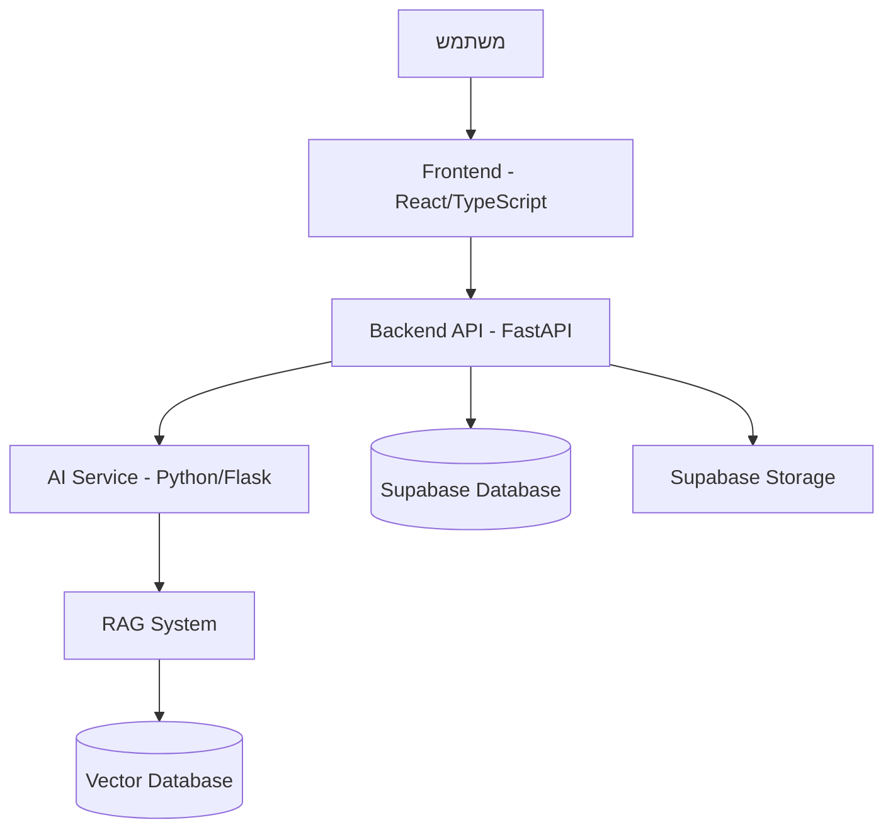

# APEX Afeka ChatBot 🤖

> **An intelligent AI-powered chatbot designed to help Afeka College students easily access and understand academic regulations and information.**

[](https://fastapi.tiangolo.com/)
[](https://reactjs.org/)
[](https://www.typescriptlang.org/)
[](https://supabase.com/)
[](https://www.docker.com/)

## 📖 תוכן עניינים

- [תיאור הפרויקט](#תיאור-הפרויקט)
- [אדריכלות המערכת](#אדריכלות-המערכת)
- [התקנה והפעלה מהירה](#התקנה-והפעלה-מהירה)
- [מבנה הפרויקט](#מבנה-הפרויקט)
- [טכנולוגיות](#טכנולוגיות)
- [פיתוח מקומי](#פיתוח-מקומי)
- [בדיקות](#בדיקות)
- [פריסה](#פריסה)
- [צוות הפיתוח](#צוות-הפיתוח)
- [תרומה לפרויקט](#תרומה-לפרויקט)

## 🎯 תיאור הפרויקט

APEX Afeka ChatBot הוא מערכת חכמה מבוססת בינה מלאכותית שמטרתה לסייע לסטודנטים במכללת אפקה לקבל מידע מהיר ומדויק על תקנון אקדמי, נהלים ומידע רלוונטי נוסף. המערכת מספקת חוויית משתמש מתקדמת עם תמיכה רב-לשונית (עברית ואנגלית) וממשק ניהול מתקדם למנהלי המערכת.

### ✨ תכונות עיקריות

- 🤖 **צ'אט בוט חכם** - תגובות מותאמות ומדויקות באמצעות RAG (Retrieval Augmented Generation)
- 📚 **ניהול מסמכים** - העלאה, ניהול ועיבוד מסמכים אקדמיים
- 📊 **דשבורד ניהול** - ממשק מתקדם למנהלי המערכת עם אנליטיקה
- 🌐 **רב-לשוני** - תמיכה מלאה בעברית ואנגלית
- 🔐 **אבטחה מתקדמת** - אימות משתמשים ובקרת גישה דרך Supabase
- 📱 **Responsive Design** - ממשק מתאים לכל סוגי המכשירים
- ⚡ **ביצועים גבוהים** - אדריכלות microservices מותאמת לעומסים גבוהים

## 🏗️ אדריכלות המערכת



## 🚀 התקנה והפעלה מהירה

### דרישות מוקדמות

- **Docker & Docker Compose** - [הורדה](https://www.docker.com/products/docker-desktop/)
- **Git** - [הורדה](https://git-scm.com/downloads)
- **מפתח Supabase** - לצורך התחברות למסד הנתונים

### הפעלה עם Docker (מומלץ)

```bash
# שכפול הפרויקט
git clone https://github.com/your-organization/afeka-chatbot.git
cd afeka-chatbot

# הגדרת משתני סביבה
export SUPABASE_KEY=your_supabase_key_here  # Linux/Mac
$env:SUPABASE_KEY="your_supabase_key_here"  # Windows PowerShell

# הפעלת המערכת
docker-compose up -d

# לפיתוח עם hot reloading
docker-compose -f docker-compose.dev.yml up -d
```

### גישה למערכת

- **Frontend**: http://localhost:80 (ייצור) או http://localhost:5173 (פיתוח)
- **Backend API**: http://localhost:8000
- **AI Service**: http://localhost:5000
- **API Documentation**: http://localhost:8000/docs

## 📁 מבנה הפרויקט

```
afeka-chatbot/
├── src/                           # קוד המקור הראשי
│   ├── frontend/                  # ממשק המשתמש (React/TypeScript)
│   │   ├── src/
│   │   │   ├── components/        # רכיבי React
│   │   │   │   ├── Chat/         # רכיבי הצ'אט
│   │   │   │   ├── Dashboard/    # דשבורד ניהול
│   │   │   │   ├── Login/        # מערכת התחברות
│   │   │   │   └── ui/           # רכיבי UI בסיסיים
│   │   │   ├── contexts/         # React Contexts
│   │   │   ├── hooks/            # Custom Hooks
│   │   │   ├── services/         # שירותי API
│   │   │   ├── types/            # TypeScript Types
│   │   │   └── utils/            # פונקציות עזר
│   │   ├── public/               # קבצים סטטיים
│   │   └── package.json
│   ├── backend/                   # שרת API (FastAPI)
│   │   ├── app/
│   │   │   ├── api/              # נקודות קצה API
│   │   │   ├── core/             # לוגיקה מרכזית
│   │   │   ├── models/           # מודלי נתונים
│   │   │   ├── services/         # שירותי עסק
│   │   │   └── repositories/     # גישה לנתונים
│   │   ├── main.py               # נקודת כניסה
│   │   └── requirements.txt
│   ├── ai/                       # שירות AI (Python/Flask)
│   │   ├── services/             # שירותי AI ו-RAG
│   │   ├── core/                 # מנועי AI
│   │   ├── utils/                # כלי עזר
│   │   └── app.py
│   └── tests/                    # בדיקות אוטומטיות
│       ├── backend/              # בדיקות Backend
│       └── frontend/             # בדיקות Frontend
├── supabase/                     # תצורת מסד נתונים
│   ├── migrations/               # סקריפטי migration
│   └── config/                   # תצורת Supabase
├── RAG_Test_Pro/                 # מערכת בדיקות RAG
├── docker-compose.yml            # תצורת Docker לייצור
├── docker-compose.dev.yml        # תצורת Docker לפיתוח
└── README.md
```

# Afeka Regulations ChatBot 🤖

An AI-powered chatbot designed to help Afeka College students easily access and understand academic regulations and information.

## 🐳 Docker Quickstart

The easiest way to run the entire application is using Docker Compose:

```bash
# Set Supabase key environment variable (required)
export SUPABASE_KEY=your_key_here  # Linux/Mac
# OR
$env:SUPABASE_KEY="your_key_here"  # Windows PowerShell

# Start all services
docker-compose up -d

# For development environment with hot reloading
docker-compose -f docker-compose.dev.yml up -d
```

Access the application:

- Frontend: http://localhost:80 (production) or http://localhost:5173 (development)
- Backend API: http://localhost:8000
- AI Service: http://localhost:5000

### Docker Commands

```bash
# View running containers
docker-compose ps

# View logs
docker-compose logs frontend
docker-compose logs backend
docker-compose logs ai-service

# Rebuild specific service
docker-compose build frontend

# Stop all services
docker-compose down

# Cleanup everything
docker-compose down --rmi all --volumes
```

## 👋 New Team Members - Start Here!

### One-Time Setup Requirements

1. **Install Docker and Docker Compose**

   - Download from [docker.com](https://www.docker.com/products/docker-desktop/)
   - Verify installation: `docker --version` and `docker-compose --version`

2. **Install Git**

   - Download from [git-scm.com](https://git-scm.com/downloads)

3. **Get Supabase Access**
   - Request access key from team lead
   - Set as environment variable before running Docker

### Manual Setup (Alternative to Docker)

#### Frontend Setup

```bash
cd src/frontend
npm install
npm run dev
```

#### Backend Setup

```bash
cd src/backend
python -m venv venv
source venv/bin/activate  # Linux/Mac
venv\Scripts\activate     # Windows
pip install -r requirements.txt
uvicorn main:app --reload
```

#### AI Service Setup

```bash
cd src/ai
python -m venv venv
source venv/bin/activate  # Linux/Mac
venv\Scripts\activate     # Windows
pip install -r requirements.txt
python app.py  # Now runs minimal AI service for key management
```

## 📁 Project Structure

```
afeka-chatbot/
├── config/               # קבצי תצורה וסביבה
│   ├── .env              # הגדרות סביבה פעילות
│   └── .env.example      # דוגמה להגדרות סביבה
├── docker/               # קבצי Docker
│   ├── docker-compose.yml        # הגדרות Docker לסביבת ייצור
│   ├── docker-compose.dev.yml    # הגדרות Docker לסביבת פיתוח
│   └── nginx.conf                # קונפיגורציית Nginx
├── scripts/              # סקריפטי הפעלה
│   ├── run_full_project.bat      # הפעלת הפרויקט המלא
│   ├── run_frontend.bat          # הפעלת הפרונטאנד בלבד
│   ├── run_chat_gui.bat          # הפעלת ממשק צ'אט גרפי
│   └── run_gemini_test.bat       # בדיקת חיבור ל-Gemini API
├── src/                  # קוד המקור
│   ├── ai/               # שירות ה-AI
│   ├── backend/          # שירות הבקאנד
│   ├── frontend/         # ממשק המשתמש
│   ├── config/           # קבצי קונפיגורציה פנימיים
│   └── supabase/         # קבצים הקשורים ל-Supabase
├── data/                 # נתונים וקבצי מידע
├── docs/                 # תיעוד הפרויקט
├── tests/                # בדיקות
└── run.bat               # סקריפט הפעלה מרכזי

```

## 🛠️ Technology Stack

### Frontend

- React with TypeScript
- Vite for development
- Tailwind CSS for styling
- i18n for internationalization (Hebrew/English)

### Backend

- Python with FastAPI
- Async HTTP with httpx
- Supabase for data storage

### AI Service

- Python with Flask
- NLP capabilities

### Infrastructure

- Docker for containerization
- Nginx as reverse proxy
- Supabase for database and storage

## Git Workflow

1. Create feature branch
2. Make changes
3. Test locally with Docker
4. Create pull request
5. Wait for review

## 👥 Team

- Niv Buskila
- Omri Roter
- Amitay Manor

## 🆘 Common Issues and Solutions

1. **Supabase Key Error**

   - Ensure SUPABASE_KEY environment variable is set

2. **Services Can't Communicate**

   - Check if all containers are running: `docker-compose ps`
   - Verify network configuration in docker-compose.yml

3. **Frontend Build Issues**

   - TypeScript errors can be bypassed with VITE_SKIP_TS_CHECK=true

4. **"Address Already In Use" Error**

   - Check if port is already in use: `netstat -ano | findstr 8000` (Windows) or `lsof -i :8000` (Mac/Linux)
   - Stop the service using that port

5. **Changes Not Reflecting**
   - In production mode, rebuild container: `docker-compose build frontend`
   - In development mode, changes should apply automatically

## 📱 Contact

- Technical questions: Create an Issue
- Urgent matters: [Team Lead Contact]

## 📚 Learning Resources

- [React Official Guide](https://react.dev)
- [TypeScript for Beginners](https://www.typescriptlang.org/docs/handbook/typescript-from-scratch.html)
- [FastAPI Tutorial](https://fastapi.tiangolo.com/tutorial/)
- [Git Basics](https://www.atlassian.com/git/tutorials/what-is-version-control)

## ⚡ Quick Start Tips

1. Start with basic technology learning
2. Read existing code to understand structure
3. Make small changes first
4. Ask questions when needed - no question is silly!

## 🧪 Testing

- Write tests for new features
- Run existing tests before pushing
- Use `npm test` for frontend
- Use `pytest` for backend

## 📦 Deployment

- Frontend builds with `npm run build`
- Backend deploys with uvicorn
- MongoDB should be running

## 🔄 CI/CD

- Automatic tests run on push
- Review required for merging
- Automatic deployment on main branch

---

💡 Remember: Everyone was a beginner once. Don't hesitate to ask questions!

## Docker Setup and Usage

### Prerequisites

- Docker and Docker Compose installed
- Git (to clone the repository)

### Setup Instructions

1. Clone the repository

```bash
git clone [repository-url]
cd Afeka_ChatBot
```

2. Configure environment variables

```bash
# The .env file is already configured with Supabase URL
# You only need to add your Supabase anon key
```

Edit the `.env` file and replace `your_supabase_anon_key_here` with your actual Supabase anon key.

3. Build and start the Docker containers

```bash
docker-compose up --build
```

4. Access the application

- Frontend: http://localhost:80
- Backend API (Python): http://localhost:8000
- AI Service: http://localhost:5000

### Development Mode

For development with hot-reloading and volume mounts:

```bash
docker-compose -f docker-compose.dev.yml up --build
```

This configuration mounts local directories to containers, allowing real-time code changes without rebuilding containers.

In development mode the frontend will be available on http://localhost:3000 instead of port 80.

### Troubleshooting Common Issues

#### Frontend Build Errors

The system is configured to continue working even if there are TypeScript errors. If you need to fix the TypeScript issues:

1. Enter the frontend container:

```bash
docker-compose exec frontend sh
```

2. Run TypeScript checks:

```bash
npm run tsc
```

#### AI Service Issues

If you experience issues with the AI service, try these steps:

1. Check service logs:

```bash
docker-compose logs ai-service
```

2. Restart just the AI service:

```bash
docker-compose restart ai-service
```

#### Communication Between Services

If services can't communicate with each other:

- Backend->AI: Check that AI_SERVICE_URL is set to "http://ai-service:5000"
- Frontend->Backend: Verify that VITE_BACKEND_URL is set correctly

### Additional Commands

#### Run in detached mode

```bash
docker-compose up -d
```

#### View logs

```bash
docker-compose logs -f
```

#### Stop containers

```bash
docker-compose down
```

#### Access container shell

```bash
# For Python containers (backend, ai-service)
docker-compose exec backend sh
docker-compose exec ai-service sh

# For Node.js container (frontend)
docker-compose exec frontend sh
```

#### Remove volumes (will delete persistent data)

```bash
docker-compose down -v
```

## Project Structure

- `frontend/`: Web interface (React/TypeScript)
- `backend/`: API and business logic (Python/FastAPI)
- `ai/`: AI models and processing (Python/Flask)
- `supabase/`: Database schema and migrations

## Technology Stack in Docker Environment

- Frontend: React with TypeScript, Vite, Tailwind CSS
- Backend: Python with FastAPI
- AI Service: Python with Flask
- Database: Supabase

## Supabase Configuration

The application is configured to connect to your Supabase project.

**⚠️ Security Note**: Supabase URL and keys are configured through environment variables in `.env` files. Never hardcode these values in your source code.

### Existing Tables

The following tables exist in the Supabase database:

- `document_analytics`: Analytics data for document interactions
- `documents`: Main document storage
- `documents_with_logging`: Documents with additional logging information
- `security_events`: Security-related events
- `users`: User information and permissions

If you need to access conversation history, ensure you add a `conversations` table with the following schema:

- `id`: UUID (primary key)
- `user_id`: String
- `message`: Text
- `response`: JSON
- `created_at`: Timestamp with time zone

## API Endpoints

### Backend (FastAPI)

- `GET /health`: Health check
- `POST /api/chat`: Process chat messages
- `GET /api/documents`: Get documents
- `POST /api/documents`: Create a new document

### AI Service (Flask - Minimal)

- `GET /`: Health check
- `GET /status`: Key management status for DatabaseKeyManager
- `GET /api/key-status`: Alternative key status endpoint

## Future Enhancements

### RAG (Retrieval Augmented Generation) Implementation

The system is designed with placeholders for a future RAG implementation that will provide accurate responses based on institutional documents:

1. **Document Storage**: Already implemented through Supabase, allowing admin users to upload regulatory documents
2. **AI Service**: Currently provides basic placeholder responses, but designed to be extended with RAG capabilities
3. **Frontend Integration**: UI already set up for chat interactions with backend API

When implemented, the RAG system will:

- Extract knowledge from uploaded documents
- Build semantic vector representations of document content
- Match user queries to the most relevant document sections
- Generate accurate, context-aware responses based on the institution's own documentation

This approach will ensure that responses are factually accurate, up-to-date, and specific to the institution's regulations without requiring constant manual updates to response templates.

## Developer Setup Guide

This guide will help you set up the Afeka ChatBot project on your local machine for development.

### Prerequisites

1. **Node.js** (v18 or later)
2. **Python** (v3.10 or later)
3. **Git**
4. **Supabase** account (for database access)

### Getting Started

#### Clone the Repository

1. Open a terminal and run:

   ```bash
   git clone https://github.com/your-org/afeka-chatbot.git
   cd afeka-chatbot
   ```

2. Checkout the development branch:
   ```bash
   git checkout "Omri's"
   ```
   Note: The quotes are important due to the apostrophe in the branch name.

#### Backend Setup

1. Create and activate a Python virtual environment:

   ```bash
   # Windows
   python -m venv backend_venv
   backend_venv\Scripts\activate

   # macOS/Linux
   python -m venv backend_venv
   source backend_venv/bin/activate
   ```

2. Install Python dependencies:

   ```bash
   cd src/backend
   pip install -r requirements.txt
   ```

3. Set up environment variables:
   - Create a `.env` file in the `src/backend` directory
   - Add the following variables (replace with actual values):
   ```
   SUPABASE_URL=your_supabase_url
   SUPABASE_KEY=your_supabase_key
   ```

#### Frontend Setup

1. Install Node.js dependencies:

   ```bash
   cd src/frontend
   npm install
   ```

2. Set up environment variables:
   - Create a `.env` file in the `src/frontend` directory
   - Add the following variables (replace with actual values):
   ```
   VITE_SUPABASE_URL=your_supabase_url
   VITE_SUPABASE_ANON_KEY=your_supabase_anon_key
   ```

### Running the Application

#### Option 1: Run Frontend and Backend Separately

1. **Backend**:

   ```bash
   # From the project root, with virtual environment activated
   cd src/backend
   python main.py  # Runs the main FastAPI backend
   ```

   The backend will be available at `http://localhost:8000`

2. **AI Service**:

   ```bash
   # In a new terminal, from the project root
   cd src/ai
   python app.py  # Runs minimal AI service for key management
   ```

   The AI service will be available at `http://localhost:5000`

3. **Frontend**:
   ```bash
   # In a new terminal
   cd src/frontend
   npm run dev
   ```
   The frontend will be available at `http://localhost:5174`

#### Option 2: Use the Batch Scripts (Windows Only)

For convenience, you can use the included batch scripts:

1. To run the frontend only:

   ```
   run_frontend.bat
   ```

2. To run both frontend and backend:
   ```
   run_full_project.bat
   ```

### Working with Translations

The application supports both English and Hebrew:

- Translation files are located in `src/frontend/src/i18n/locales/`
- When adding new text to the UI, ensure you add the translations to both language files
- Use direct translation values (not translation keys) in components that show language keys

### Version Control Guidelines

1. Create a new branch for each feature:

   ```bash
   git checkout -b feature/your-feature-name
   ```

2. Commit messages should be in English and descriptive

3. Before pushing, ensure your code is properly formatted and lint-free

4. Push to your branch and create a pull request to the main development branch

### Troubleshooting

If you encounter any issues:

1. Ensure all dependencies are installed
2. Check that environment variables are correctly set
3. Make sure Supabase is properly configured
4. Restart the development servers

For database-related issues, check the Supabase console for any errors.

### Contact

For questions or access issues, contact the project lead.

## 🧪 Running Tests (Pytest without Virtual Environment)

If you prefer to run `pytest` using your global Python installation (without creating a dedicated virtual environment), follow these steps. This can be useful for quick checks but be mindful of potential global package conflicts.

**1. Install Required Packages:**

Make sure you have `pytest` and other necessary libraries installed globally. If you encounter `ImportError` issues related to `langchain` or other packages during testing, you might need to install or upgrade them:

```bash
python -m pip install --upgrade pip
python -m pip install pytest sentence-transformers langchain langchain_experimental langchain-google-genai python-dotenv
```

_(Adjust the list of packages as needed based on your project's specific test dependencies and any `ImportError` messages you see)._

**2. Configure PYTHONPATH (Important for Module Resolution):**

When running `pytest` from the project root, Python might not be able to find your project's internal modules (e.g., those inside `src/backend` or `src/ai`). To fix `ModuleNotFoundError` issues:

- **For Backend Tests:** If your tests import modules from `src/backend/services` or `src/backend/app`, you need to add `src/backend` to your `PYTHONPATH`.
- **For AI Tests:** Similarly, if tests import from `src/ai`, you might need to adjust `PYTHONPATH`.

Example for PowerShell (when running tests that need `src/backend`):

```powershell
$env:PYTHONPATH = "src\backend"
```

Or for bash/zsh:

```bash
export PYTHONPATH="src/backend"
```

You'll need to set this in your terminal session _before_ running `pytest`.

**3. Run Pytest:**

Once packages are installed and `PYTHONPATH` is set correctly for your context, run `pytest` with verbose output:

```powershell
# Example for backend tests (assuming PYTHONPATH is set as above)
python -m pytest -vv
```

If tests are located in a specific directory (e.g., `tests/backend`), you can target them:

```powershell
python -m pytest -vv tests/backend
```

**Troubleshooting `ImportError: cannot import name 'SemanticChunker' from 'langchain.text_splitter'`:**

This specific error means that the `SemanticChunker` has moved. It's now in `langchain_experimental.text_splitter`. Ensure your code imports it correctly:

```python
# Old, incorrect import:
# from langchain.text_splitter import SemanticChunker

# New, correct import:
from langchain_experimental.text_splitter import SemanticChunker
```

Make sure all files using `SemanticChunker` (like `rag_service.py` and `document_processor.py`) are updated. Also, ensure `langchain_experimental` is installed.

## 📋 סקירה כללית

הפרויקט כולל שלושה סוגי טסטים:
- **Frontend Tests** - טסטים לצד הלקוח (React/TypeScript)
- **Backend Tests** - טסטים לצד השרת (Python/FastAPI)
- **RAG Tests** - טסטי איכות תשובות AI ומערכת החיפוש

## 🎯 Frontend Tests

### מיקום: `src/frontend/tests/`

**3 קבצי טסט עם 27 טסטים:**

1. **`simple.test.tsx`** (4 טסטים)
   - חישוב סה"כ טוקנים
   - לוגיקת מעבר מפתחות (60% threshold)
   - סיווג סטטוס מפתחות
   - פורמט נתונים

2. **`dashboard-logic.test.tsx`** (13 טסטים)
   - חישובי טוקנים מורכבים
   - לוגיקת switching עם margins שונים
   - סיווג מפתחות לפי סטטוס
   - אגרגציה של נתונים
   - וולידציה של נתונים

3. **`TokenUsageAnalytics.test.tsx`** (10 טסטים)
   - פורמט מספרים עם פסיקים
   - חישוב סטטיסטיקות
   - בדיקת localization (עברית/אנגלית)
   - וולידציה של API responses

### 🚀 הרצת טסטי Frontend:

```bash
# נווט לתיקיית Frontend
cd src/frontend

# הרץ את כל הטסטים
npm test

# הרץ במצב watch (מעקב אוטומטי)
npm run test:watch

# הרץ טסט ספציפי
npx vitest simple.test.tsx
```

**זמן ריצה**: ~8 שניות  
**שיעור הצלחה**: 100% (27/27)

## 🔧 Backend Tests

### מיקום: `src/tests/backend/`

**9 קבצי טסט עם 123 טסטים:**

1. **`tests_01_auth.py`** (11 טסטים) - אימות והרשאות
2. **`tests_02_chat_sessions.py`** (14 טסטים) - ניהול צ'אט
3. **`tests_03_messages.py`** (13 טסטים) - טיפול בהודעות
4. **`tests_04_ai_integration.py`** (15 טסטים) - אינטגרציה עם AI
5. **`tests_05_documents.py`** (17 טסטים) - ניהול מסמכים ו-RAG
6. **`tests_06_security.py`** (16 טסטים) - אבטחה
7. **`tests_07_errors.py`** (13 טסטים) - טיפול בשגיאות
8. **`tests_08_e2e.py`** (12 טסטים) - טסטי End-to-End
9. **`tests_09_performance.py`** (12 טסטים) - ביצועים

### 🚀 הרצת טסטי Backend:

```bash
# נווט לתיקיית הטסטים
cd src/tests/backend

# הרץ את כל הטסטים
python tests_runner.py --all --verbose

# הרץ קטגוריה ספציפית
python tests_runner.py --category auth --verbose

# הרץ טסט ספציפי
pytest tests_01_auth.py -v
```

**זמן ריצה**: ~11.5 דקות  
**שיעור הצלחה**: 100% (123/123)

## 🧠 RAG Tests

### מיקום: `RAG_test/`

**3 סטים של שאלות עם 90 שאלות בסך הכל:**

1. **Basic RAG Test Set** (30 שאלות)
   - 🔍 דיוק מספרי סעיפים (8 שאלות)
   - 🧠 שאלות תוכן מורכבות (8 שאלות)
   - ⚖️ שאלות משמעת (7 שאלות)
   - 🤔 שאלות אמביגואליות (4 שאלות)
   - 🪤 שאלות מלכודת (3 שאלות)

2. **Detailed Accuracy Test Set** (30 שאלות)
   - בדיקות מקיפות של דיוק RAG
   - שאלות מורכבות ומפורטות

3. **Real Student Questions** (30 שאלות)
   - שאלות שמדמות פניות אמיתיות של סטודנטים
   - תרחישים מעשיים מהחיים האמיתיים

### 🚀 הרצת טסטי RAG:

```bash
# נווט לתיקיית RAG
cd RAG_test

# הרץ את כל הטסטים (90 שאלות)
python test_runner.py

# דיבוג מהיר
python debug_rag.py
```

**דרישות**:
- משתני סביבה: `GEMINI_API_KEY`, `SUPABASE_URL`, `SUPABASE_KEY`
- מסד נתונים Supabase עם מסמכים מעובדים

**זמן ריצה**: ~13 דקות  
**פרופילים זמינים**: 9 פרופילי תצורה שונים

### 📊 דוחות RAG:
- `test_report_[timestamp].txt` - דוח מפורט בעברית
- `chunks_analysis_[timestamp].txt` - ניתוח צ'אנקים
- `rag_settings_[timestamp].json` - הגדרות מערכת
- `raw_results_[timestamp].json` - נתונים גולמיים

## 🎯 הרצת כל הטסטים

### סקריפט מהיר להרצת הכל:

```bash
# Frontend Tests
cd src/frontend && npm test

# Backend Tests  
cd ../../src/tests/backend && python tests_runner.py --all

# RAG Tests
cd ../../../RAG_test && python test_runner.py
```

## 📊 סיכום כולל

### **240 טסטים בסך הכל:**
- ✅ **Frontend**: 27 טסטים (8 שניות)
- ✅ **Backend**: 123 טסטים (11.5 דקות)
- ✅ **RAG**: 90 שאלות (13 דקות)

### **זמן ריצה כולל**: ~25 דקות

## 🔧 דרישות מערכת

### Frontend:
- Node.js 16+
- npm או yarn
- Dependencies: `@testing-library/react`, `@testing-library/jest-dom`

### Backend:
- Python 3.8+
- pytest
- pytest-json-report
- כל התלויות מ-`requirements.txt`

### RAG:
- Python 3.8+
- Gemini API Key
- Supabase Database
- מסמכים מעובדים במסד הנתונים

## 🐛 פתרון בעיות

### שגיאות נפוצות:

**Frontend**: `Module not found`
```bash
cd src/frontend && npm install
```

**Backend**: `pytest not found`
```bash
pip install pytest pytest-json-report
```

**RAG**: `supabase_url is required`
```bash
# בדוק קובץ .env בשורש הפרויקט
SUPABASE_URL=your_url
SUPABASE_KEY=your_key
GEMINI_API_KEY=your_key
```

## 📈 מדדי הצלחה

- **Frontend**: 100% pass rate (27/27)
- **Backend**: 100% pass rate (123/123)
- **RAG**: תלוי בתצורה (מטרה: 80%+)

## 🔄 הרצה תקופתית

מומלץ להריץ:
- **Frontend**: לפני כל commit
- **Backend**: לפני כל deployment
- **RAG**: אחת לשבוע או לאחר שינויי תוכן

---

**נוצר ועודכן על ידי מערכת הבדיקה האוטומטית** 🎓
