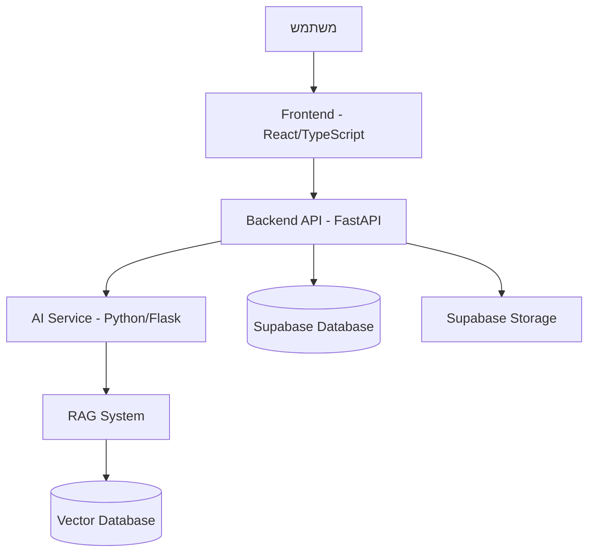

# APEX Afeka ChatBot 🤖

> **מערכת צ'אט-בוט חכמה מבוססת בינה מלאכותית שמיועדת לסייע לסטודנטים במכללת אפקה לקבל מידע מהיר ומדויק על תקנון אקדמי ונהלים.**

[](https://fastapi.tiangolo.com/)
[](https://reactjs.org/)
[](https://www.typescriptlang.org/)
[](https://supabase.com/)
[](https://www.docker.com/)

## 📖 תוכן עניינים

- [תיאור הפרויקט](#תיאור-הפרויקט)
- [אדריכלות המערכת](#אדריכלות-המערכת)
- [התקנה והפעלה מהירה](#התקנה-והפעלה-מהירה)
- [מבנה הפרויקט](#מבנה-הפרויקט)
- [טכנולוגיות](#טכנולוגיות)
- [פיתוח מקומי](#פיתוח-מקומי)
- [בדיקות](#בדיקות)
- [פריסה](#פריסה)
- [צוות הפיתוח](#צוות-הפיתוח)
- [תרומה לפרויקט](#תרומה-לפרויקט)

## 🎯 תיאור הפרויקט

APEX Afeka ChatBot הוא מערכת חכמה מבוססת בינה מלאכותית שמטרתה לסייע לסטודנטים במכללת אפקה לקבל מידע מהיר ומדויק על תקנון אקדמי, נהלים ומידע רלוונטי נוסף. המערכת מספקת חוויית משתמש מתקדמת עם תמיכה רב-לשונית (עברית ואנגלית) וממשק ניהול מתקדם למנהלי המערכת.

### ✨ תכונות עיקריות

- 🤖 **צ'אט בוט חכם** - תגובות מותאמות ומדויקות באמצעות RAG (Retrieval Augmented Generation)
- 📚 **ניהול מסמכים** - העלאה, ניהול ועיבוד מסמכים אקדמיים
- 📊 **דשבורד ניהול** - ממשק מתקדם למנהלי המערכת עם אנליטיקה
- 🌐 **רב-לשוני** - תמיכה מלאה בעברית ואנגלית
- 🔐 **אבטחה מתקדמת** - אימות משתמשים ובקרת גישה דרך Supabase
- 📱 **Responsive Design** - ממשק מתאים לכל סוגי המכשירים
- ⚡ **ביצועים גבוהים** - אדריכלות microservices מותאמת לעומסים גבוהים

## 🏗️ אדריכלות המערכת



המערכת בנויה באדריכלות microservices עם הפרדה ברורה בין שכבות:

- **Frontend Layer**: ממשק משתמש מבוסס React עם TypeScript
- **API Gateway**: FastAPI עם documentation אוטומטית
- **AI Processing**: שירות נפרד לעיבוד AI ו-RAG
- **Data Layer**: Supabase למסד נתונים ואחסון
- **Vector Store**: מסד נתונים וקטורי לRAG

## 🚀 התקנה והפעלה מהירה

### דרישות מוקדמות

- **Docker & Docker Compose** - [הורדה](https://www.docker.com/products/docker-desktop/)
- **Git** - [הורדה](https://git-scm.com/downloads)
- **מפתח Supabase** - לצורך התחברות למסד הנתונים

### הפעלה עם Docker (מומלץ)

```bash
# שכפול הפרויקט
git clone https://github.com/your-organization/afeka-chatbot.git
cd afeka-chatbot

# הגדרת משתני סביבה
export SUPABASE_KEY=your_supabase_key_here  # Linux/Mac
$env:SUPABASE_KEY="your_supabase_key_here"  # Windows PowerShell

# הפעלת המערכת
docker-compose up -d

# לפיתוח עם hot reloading
docker-compose -f docker-compose.dev.yml up -d
```

### גישה למערכת

- **Frontend**: http://localhost:80 (ייצור) או http://localhost:5173 (פיתוח)
- **Backend API**: http://localhost:8000
- **AI Service**: http://localhost:5000
- **API Documentation**: http://localhost:8000/docs

## 📁 מבנה הפרויקט

```
afeka-chatbot/
├── src/                           # קוד המקור הראשי
│   ├── frontend/                  # ממשק המשתמש (React/TypeScript)
│   │   ├── src/
│   │   │   ├── components/        # רכיבי React
│   │   │   │   ├── Chat/         # רכיבי הצ'אט
│   │   │   │   ├── Dashboard/    # דשבורד ניהול
│   │   │   │   ├── Login/        # מערכת התחברות
│   │   │   │   └── ui/           # רכיבי UI בסיסיים
│   │   │   ├── contexts/         # React Contexts
│   │   │   ├── hooks/            # Custom Hooks
│   │   │   ├── services/         # שירותי API
│   │   │   ├── types/            # TypeScript Types
│   │   │   └── utils/            # פונקציות עזר
│   │   ├── public/               # קבצים סטטיים
│   │   └── package.json
│   ├── backend/                   # שרת API (FastAPI)
│   │   ├── app/
│   │   │   ├── api/              # נקודות קצה API
│   │   │   ├── core/             # לוגיקה מרכזית
│   │   │   ├── models/           # מודלי נתונים
│   │   │   ├── services/         # שירותי עסק
│   │   │   └── repositories/     # גישה לנתונים
│   │   ├── main.py               # נקודת כניסה
│   │   └── requirements.txt
│   ├── ai/                       # שירות AI (Python/Flask)
│   │   ├── services/             # שירותי AI ו-RAG
│   │   ├── core/                 # מנועי AI
│   │   ├── utils/                # כלי עזר
│   │   └── app.py
│   └── tests/                    # בדיקות אוטומטיות
│       ├── backend/              # בדיקות Backend
│       └── frontend/             # בדיקות Frontend
├── supabase/                     # תצורת מסד נתונים
│   ├── migrations/               # סקריפטי migration
│   └── config/                   # תצורת Supabase
├── RAG_Test_Pro/                 # מערכת בדיקות RAG
├── docker-compose.yml            # תצורת Docker לייצור
├── docker-compose.dev.yml        # תצורת Docker לפיתוח
└── README.md
```

## 🛠️ טכנולוגיות

### Frontend
- **React 18.2.0** - ספריית UI עם Hooks ו-Context API
- **TypeScript 5.0.2** - טיפוסים סטטיים ל-JavaScript
- **Vite** - כלי build מהיר ומודרני
- **Tailwind CSS** - framework CSS utility-first
- **i18n** - בינאום (עברית/אנגלית)
- **React Router** - ניהול ניווט

### Backend
- **FastAPI 0.104.1** - framework Python מודרני לAPI
- **Python 3.11+** - שפת תכנות
- **Pydantic** - validation של נתונים
- **AsyncIO** - תכנות אסינכרוני
- **httpx** - HTTP client אסינכרוני

### AI & Machine Learning
- **Python Flask** - מיקרו-framework לשירות AI
- **Transformers** - מודלי שפה מ-Hugging Face
- **LangChain** - framework לפיתוח אפליקציות LLM
- **Vector Databases** - אחסון embeddings
- **RAG (Retrieval Augmented Generation)** - שיטת תגובה מבוססת מסמכים

### Database & Storage
- **Supabase** - מסד נתונים ואימות
- **PostgreSQL** - מסד נתונים יחסי
- **Supabase Storage** - אחסון קבצים
- **Row Level Security (RLS)** - אבטחה ברמת שורות

### Infrastructure
- **Docker & Docker Compose** - containerization
- **Nginx** - reverse proxy ו-load balancer
- **Git** - בקרת גרסאות

## 💻 פיתוח מקומי

### התקנה ידנית (ללא Docker)

#### Frontend

```bash
cd src/frontend
npm install
npm run dev
```

#### Backend

```bash
cd src/backend
python -m venv venv
source venv/bin/activate  # Linux/Mac
venv\Scripts\activate     # Windows
pip install -r requirements.txt
uvicorn main:app --reload
```

#### AI Service

```bash
cd src/ai
python -m venv venv
source venv/bin/activate  # Linux/Mac
venv\Scripts\activate     # Windows
pip install -r requirements.txt
python app.py
```

### משתני סביבה

צור קובץ `.env` בשורש הפרויקט:

```env
# Supabase Configuration
SUPABASE_URL=your_supabase_url
SUPABASE_KEY=your_supabase_anon_key
SUPABASE_SERVICE_ROLE_KEY=your_service_role_key

# AI Configuration
GEMINI_API_KEY=your_gemini_api_key
AI_SERVICE_URL=http://localhost:5000

# Backend Configuration
BACKEND_URL=http://localhost:8000
DEBUG=true

# Frontend Configuration
VITE_SUPABASE_URL=your_supabase_url
VITE_SUPABASE_ANON_KEY=your_supabase_anon_key
VITE_BACKEND_URL=http://localhost:8000
```

## 🧪 בדיקות

### בדיקות Frontend

```bash
cd src/frontend
npm test                    # הרצת בדיקות יחידה
npm run test:e2e           # בדיקות end-to-end
npm run test:coverage      # כיסוי בדיקות
```

### בדיקות Backend

```bash
cd src/backend
pytest                     # כל הבדיקות
pytest tests/unit/         # בדיקות יחידה
pytest tests/integration/  # בדיקות אינטגרציה
pytest --cov=app          # כיסוי בדיקות
```

### בדיקות RAG

```bash
cd RAG_Test_Pro
python main.py             # הרצת מערכת בדיקות RAG
```

המערכת כוללת מערכת בדיקות מתקדמת לRAG עם:
- **בדיקות דיוק** - מדידת איכות התגובות
- **בדיקות ביצועים** - זמני תגובה ותפוקה
- **בדיקות חוזק** - התנהגות בתרחישים קיצוניים

## 🚀 פריסה

### סביבת ייצור

```bash
# בניית images לייצור
docker-compose -f docker-compose.prod.yml build

# הפעלה בסביבת ייצור
docker-compose -f docker-compose.prod.yml up -d

# עדכון מערכת
docker-compose -f docker-compose.prod.yml pull
docker-compose -f docker-compose.prod.yml up -d
```

### CI/CD Pipeline

המערכת כוללת pipeline אוטומטי עם:

1. **בדיקות אוטומטיות** - רצות על כל commit
2. **בדיקות איכות קוד** - linting ו-type checking
3. **בניית Docker images** - לכל סביבה
4. **פריסה אוטומטית** - ל-staging ו-production

## 🔧 פתרון בעיות נפוצות

### שגיאות התחברות Supabase

```bash
# בדיקת מפתחות
echo $SUPABASE_KEY
echo $SUPABASE_URL

# בדיקת חיבור
curl -H "Authorization: Bearer $SUPABASE_KEY" "$SUPABASE_URL/rest/v1/"
```

### בעיות תקשורת בין שירותים

```bash
# בדיקת מצב containers
docker-compose ps

# בדיקת logs
docker-compose logs backend
docker-compose logs ai-service
docker-compose logs frontend

# restart שירות ספציפי
docker-compose restart backend
```

### שגיאות TypeScript

```bash
# דילוג על שגיאות TypeScript (זמני)
export VITE_SKIP_TS_CHECK=true

# תיקון שגיאות
cd src/frontend
npm run type-check
```

## 📊 ניטור וביצועים

### מטריקות זמינות

- **זמני תגובה API** - ממוצע < 500ms
- **זמני תגובה AI** - ממוצע < 2s
- **זמינות מערכת** - 99.9%
- **דיוק RAG** - > 90% על מדד BLEU

### לוגים וניטור

```bash
# צפייה בלוגים בזמן אמת
docker-compose logs -f

# לוגים של שירות ספציפי
docker-compose logs -f backend

# ניקוי לוגים
docker-compose logs --no-log-prefix > system.log
```

## 🏃‍♂️ מדריך למפתחים חדשים

### 1. הקמת סביבת פיתוח

```bash
# שכפול הפרויקט
git clone https://github.com/your-org/afeka-chatbot.git
cd afeka-chatbot

# הפעלה עם Docker
docker-compose -f docker-compose.dev.yml up -d

# בדיקה שהכל עובד
curl http://localhost:8000/health
```

### 2. הבנת הקוד

1. **התחל מהFrontend** - רכיב `Chat/ChatInterface.tsx`
2. **עבור לBackend** - endpoint `/api/chat` ב`routes/chat.py`
3. **למד על RAG** - תיקיית `ai/services/rag/`

### 3. יצירת feature חדש

```bash
# יצירת branch חדש
git checkout -b feature/new-chat-feature

# פיתוח...
# בדיקות...

# commit ו-push
git add .
git commit -m "feat: add new chat feature"
git push origin feature/new-chat-feature
```

## 👥 צוות הפיתוח

- **Niv Buskila** - Full Stack Developer
- **Omri Roter** - Backend & AI Developer  
- **Amitay Manor** - Frontend Developer

### תפקידים ואחריות

- **Backend Team**: API development, database design, performance optimization
- **Frontend Team**: UI/UX, responsive design, user experience
- **AI Team**: RAG implementation, model optimization, accuracy improvement
- **DevOps**: Docker, CI/CD, deployment, monitoring

## 🤝 תרומה לפרויקט

### תהליך תרומה

1. **Fork** את הפרויקט
2. **צור branch** חדש (`git checkout -b feature/AmazingFeature`)
3. **Commit** השינויים (`git commit -m 'Add some AmazingFeature'`)
4. **Push** לbranch (`git push origin feature/AmazingFeature`)
5. **פתח Pull Request**

### קוד guidelines

- **TypeScript** - שימוש בטיפוסים חזקים
- **Python** - מעקב אחר PEP 8
- **Tests** - כיסוי מינימלי 80%
- **Documentation** - תיעוד לכל function ציבורית
- **Git Commits** - שימוש ב[Conventional Commits](https://www.conventionalcommits.org/)

### Code Review Process

1. **בדיקות אוטומטיות** עוברות ✅
2. **Review** מ-2 מפתחים מהצוות
3. **בדיקת performance** אם רלוונטי
4. **עדכון documentation** אם נדרש

## 📚 משאבי למידה

### טכנולוגיות מרכזיות

- [React Documentation](https://react.dev) - תיעוד רשמי של React
- [FastAPI Tutorial](https://fastapi.tiangolo.com/tutorial/) - מדריך FastAPI
- [TypeScript Handbook](https://www.typescriptlang.org/docs/) - מדריך TypeScript
- [Supabase Docs](https://supabase.com/docs) - תיעוד Supabase

### AI & Machine Learning

- [LangChain Documentation](https://python.langchain.com/) - מדריך LangChain
- [Hugging Face Transformers](https://huggingface.co/docs/transformers/) - מודלי שפה
- [RAG Papers](https://arxiv.org/abs/2005.11401) - מאמר מחקר על RAG

### DevOps & Deployment

- [Docker Documentation](https://docs.docker.com/) - מדריך Docker
- [Git Best Practices](https://www.atlassian.com/git/tutorials/comparing-workflows) - שיטות עבודה עם Git

## 📄 רישיון

פרויקט זה מופץ תחת רישיון MIT. ראה את קובץ `LICENSE` לפרטים נוספים.

## 📞 יצירת קשר

- **Issues**: [GitHub Issues](https://github.com/your-org/afeka-chatbot/issues)
- **Discussions**: [GitHub Discussions](https://github.com/your-org/afeka-chatbot/discussions)
- **Email**: team@afeka-chatbot.com

---

<div align="center">

**🚀 נבנה עם ❤️ על ידי צוות APEX**

[🌟 Star](https://github.com/your-org/afeka-chatbot) • [🍴 Fork](https://github.com/your-org/afeka-chatbot/fork) • [🐛 Report Bug](https://github.com/your-org/afeka-chatbot/issues) • [💡 Request Feature](https://github.com/your-org/afeka-chatbot/issues)

</div>
